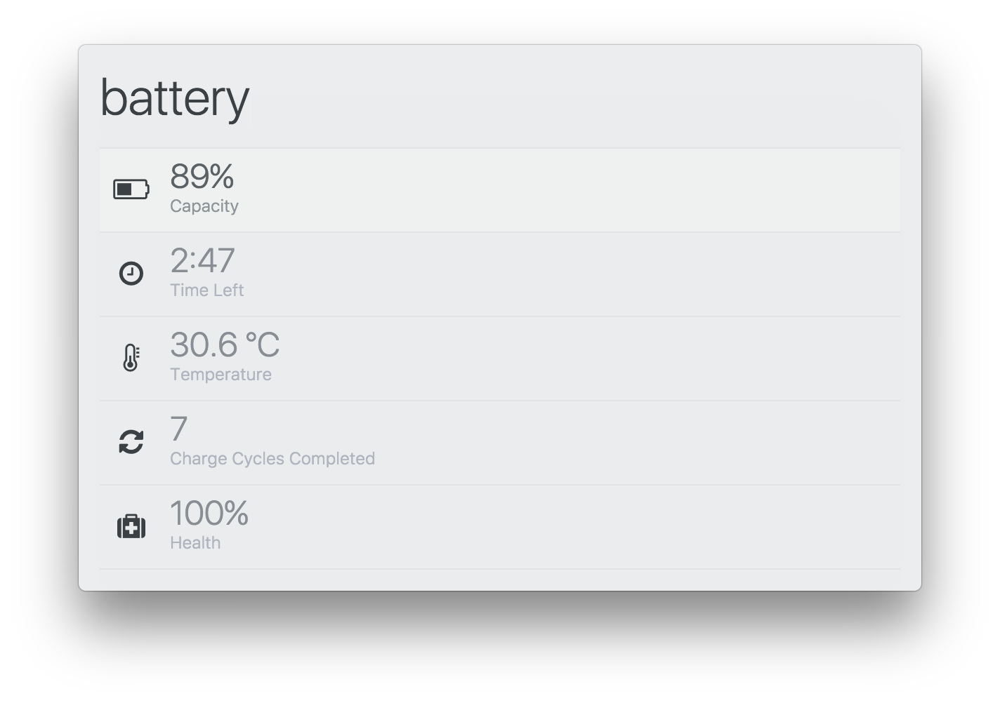

# zazu-battery

> [Zazu](https://github.com/tinytacoteam/zazu) plugin to show information about your battery

[](https://travis-ci.org/danielbayerlein/zazu-battery)
[](https://codecov.io/gh/danielbayerlein/zazu-battery)
[](https://standardjs.com)
[](https://greenkeeper.io/)

## Usage

To show information about your battery simply type `battery`.



## Install

Add `danielbayerlein/zazu-battery` inside of `plugins` block of your `~/.zazurc.json` file.

```json
{
  "plugins": [
    "danielbayerlein/zazu-battery"
  ]
}
```

## Supported Operating Systems

* macOS

## License

Copyright (c) 2017 Daniel Bayerlein. See [LICENSE](./LICENSE.md) for details.
